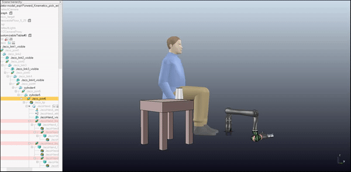
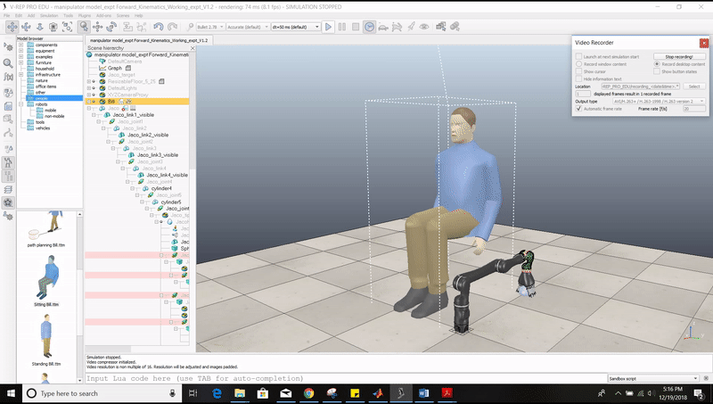

# Project - Wheel Chair Mounted Robotic Arm
This Project models a Wheel Chair mounted Robotic Arm which can be used as an aid for Quadriplegics to interact with the environment

This Project models the Forward Kinematics of Kinova Robotics Jaco Arm attached to a wheel chair 
This Project also models the Inversre Kinematics of Kinova Robotics Jaco Arm attached to a wheel chair
The project also validates both the Forward and Inverse Kinematics

## Dependencies
* Works with `VREP 3.5.0` and above
* `Matlab 2018` and above

## Execution

## Results
The results are listed in the report `doc/Project Report V1.2.pdf`
The output videos can be found in the `output/`

## See how it works

### Forward Kinematics

<em>Forward Kinematics</em>

### Inverse Kinematics

<em>Inverse Kinematics</em>

